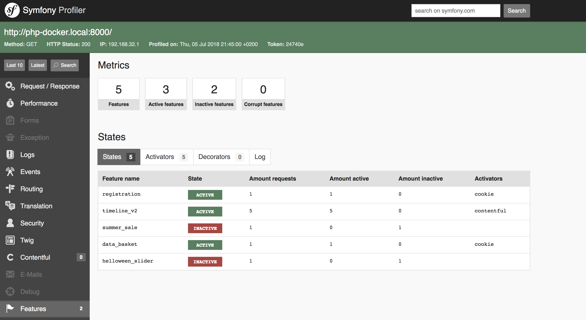

# Flagception
**Feature toggle bundle on steroids!** Flagception is a simple and powerful feature toggle system for php.
This bundle integrates the [Flagception PHP Libary](https://packagist.org/packages/flagception/flagception) for symfony 2.7 to 4.2 (and php 5.6 to php7.2).

[](https://packagist.org/packages/flagception/flagception-bundle)
[](https://coveralls.io/github/bestit/flagception-bundle?branch=master)
[](https://travis-ci.org/bestit/flagception-bundle)
[](https://packagist.org/packages/flagception/flagception-bundle)
[](https://packagist.org/packages/flagception/flagception-bundle)

[](https://insight.sensiolabs.com/projects/4423478b-f6db-4f77-bb36-0782bcdf82c0)

```console
$ composer require flagception/flagception-bundle
```

Documentation
---------------------------
* [Installation](docs/install.md)
* [Upgrade from 2.x](UPGRADE-3.0.md)
* [Usage](docs/usage.md)
* [Twig flags](docs/twig.md)
* [Route flags](docs/route.md)
* [Annotation flags](docs/annotation.md)
* [Constraints](docs/constraint.md)
* [Environment variables](docs/environment.md)
* [Cookies](docs/cookie.md)
* [Database](docs/database.md)
* [Activators](docs/activator.md)
* [Contenftul](docs/contentful.md)
* [Profiler](docs/profiler.md)

Quick example
---------------------------
Set some feature in your config (or use your own [activator](docs/activator.md) for fetching features from wherever you want) ...

```yml
flagception:

    # Your Features (optional you left it empty)
    features:
    
        # Feature name as key
        feature_123:
            # Default flag if inactive or active (default: false)
            default: true
            
        # Feature state from an environment variable
        feature_abc:
            env: FEATURE_ENV_ABC
            
        # Feature with constraint (active if user id is 12 OR it is between 8 am and 6 pm)
        feature_def:
            constraint: 'user_id == 12 or (date("H") > 8 and date("H") < 18)'
                    
        # All togther (chain)
        feature_def:
            default: false
            env: FEATURE_ENV_ABC
            constraint: 'user_id == 12 or (date("H") > 8 and date("H") < 18)'
```

... and use it in controller, services or twig:

```twig

    {# Execute if feature is active ... #}

```

See [usage documentation](docs/usage.md) for detailed examples.

Profiler
---------------------------
This bundle ships a profiler tab, where you can see how often a feature was requested, which results it returns (active or inactive) and 
the given context.



Credits
-------------------------
Profiler icon from https://github.com/ionic-team/ionicons
