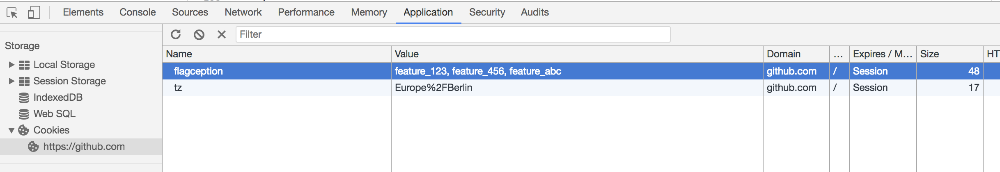

Cookies
-------------------------
You can test your features with cookies. This is by default
disabled - so you have to enabled it in your config. You can also set a cookie name and a separator.

```yml
# config.yml

flagception:
    features:      
        feature_123:
            default: false
   
    activators:
        # Cookie settings         
        cookie:
            
            # Enable cookie activator (default: false)
            enable: true
            
            # Cookie name - should be a secret key (default: 'flagception')
            name: 'flagception'
            
            # Cookie value separator for using with mutiple features (default: ',')
            separator: ','
```

Now you can set a cookie (eg. in chrome, firefox etc) and set the feature names (with separator) as value:



No matter what is set in the config - if the feature name exists in the cookie, the feature is enabled for you. Notice that featurs
can only be enabled by cookie if they exists in your config.yml. In addition, you can explicitly disable some features for cookies:

```yml
# config.yml

flagception:
    features:      
    
        # Activatable via cookie
        feature_123:
            default: false
            
        # Not activatable via cookie
        feature_456:
            cookie: false
            
        # Feature "feature_wyz" isn't activatable via cookie because the feature isn't defined in your config.yml
   
    # Cookie settings         
    cookie:
        
        # Enable cookie activator (default: false)
        enable: true
        
        # Cookie name - should be a secret key (default: 'flagception')
        name: 'flagception'
        
        # Cookie value separator for using with mutiple features (default: ',')
        separator: ','
```

Normally this acts as whitelist. That means, that only features listed in your config.yml can be enabled
by cookie (due security reasons). But you can change this behavior to a blacklist. Then you can enable
every feature by cookie unless you explicitly disabled it in your config.yml: 

```yml
# config.yml

flagception:
    features:      
    
        # Activatable via cookie
        feature_123:
            default: false
            
        # Not activatable via cookie 
        feature_456:
            cookie: false
            
        # Feature "feature_wyz" isn't defined in this config.yml but is activatable by cookie
   
    # Cookie settings         
    cookie:
        enable: true
        mode: 'blacklist'

```